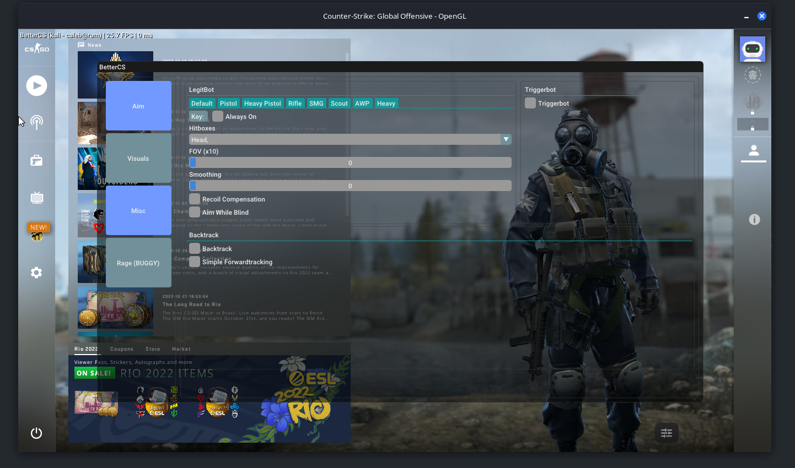

# BetterCS
</img>
Open Source CS:GO Cheat<br>
## How To Use
```sh
git clone https://github.com/calebrwalk5/BetterCS
cd BetterCS
bash toolbox.sh -p -b -l
```
### Changes made
Ragebot added<br>
Updated colors<br>
Third person<br>
Better triggerbot<br>
Better antiaim<br>
### In development
Skin changer<br>
Aim lines<br>